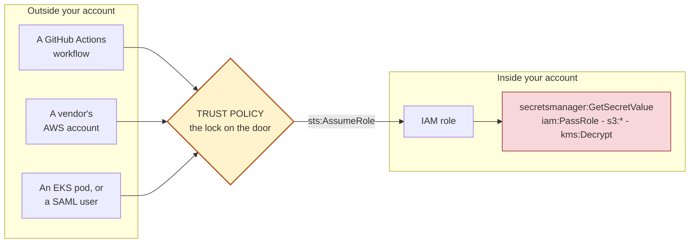
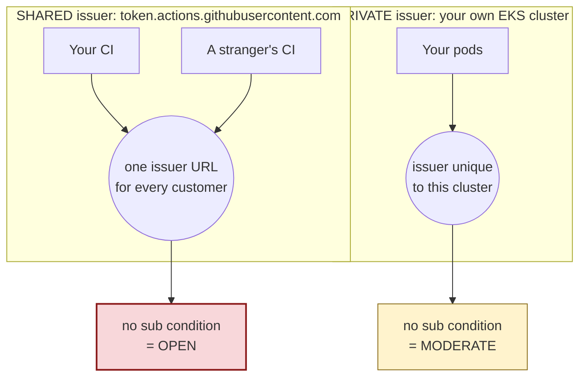
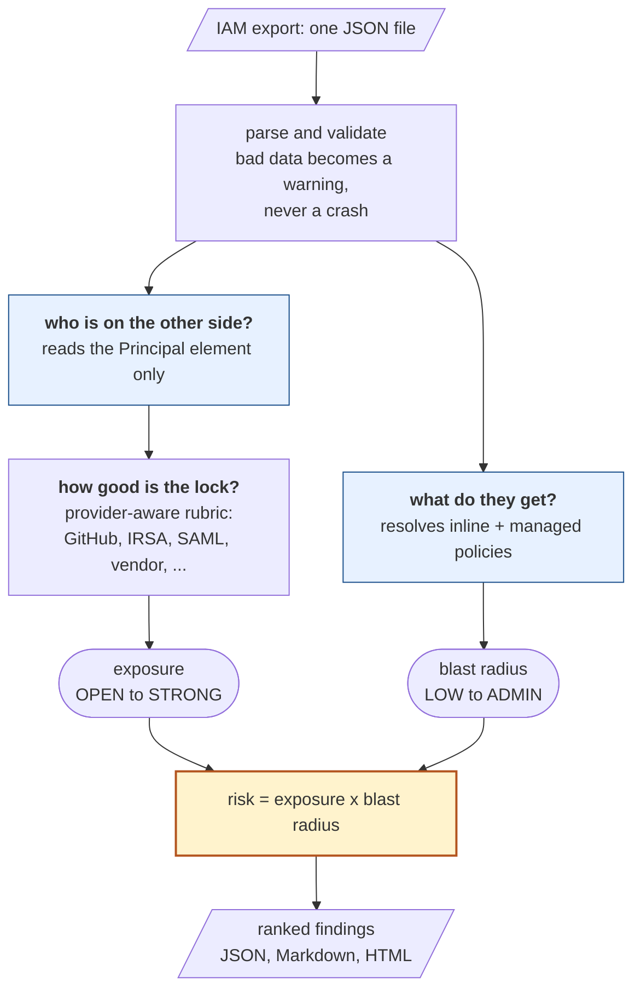

<h1 align="center">TrustEdge</h1>

<p align="center">
  <strong>AWS inbound trust boundary analyzer</strong><br>
  Finds the doors into your AWS account, grades how well each one is locked,
  and tells you what's on the other side.
</p>

<p align="center">
  <a href="https://github.com/het-P301204/TrustEdge-AWS-IAM-analyzer/actions/workflows/ci.yml"></a>
  
  
  
  <a href="LICENSE"></a>
</p>

---

## The idea in one picture

An IAM role's **trust policy** decides who is allowed to *become* that role.
It's a door. Anyone who gets through it is holding real AWS credentials.



Two questions decide whether a door matters, and **you need both answers**:

| | Question | TrustEdge calls it |
|---|---|---|
| 🚪 | How good is the lock? | **exposure** |
| 💎 | What's in the room? | **blast radius** |

A vault door on an empty room is fine. A screen door on an empty room is fine.
A screen door on the vault is the one that should wake you up. So:

```
risk = exposure × blast radius
```

---

## What it catches that a grep wouldn't

### 1. A condition that looks like a lock and isn't

```json
"Condition": {
  "StringLike":           { "token.actions.githubusercontent.com:sub": "repo:acme/deploy:*" },
  "StringEqualsIfExists": { "token.actions.githubusercontent.com:environment": "production" }
}
```

Reads like "production environment only". It isn't.

AWS documents that `...IfExists` evaluates to **true when the key is absent**,
and GitHub only sends the `environment` claim if the workflow declares one. So
a workflow that simply *doesn't mention* `environment:` sails straight through.

> TrustEdge flags `if_exists_vacuous` and refuses to count that condition as a
> lock at all.

### 2. The same missing condition meaning two different things



Every GitHub customer on earth mints tokens from that one identical URL, so a
missing subject condition lets a stranger's workflow in. Your EKS cluster has
its own issuer, so the same omission only reaches pods in *that* cluster.

> A tool that calls both "condition missing" is a tool people mute. TrustEdge
> grades them `OPEN` and `MODERATE`, and says why.

**And this is why offline analysis still matters.** AWS now rejects *new*
GitHub OIDC trust policies without a `sub` condition — but states plainly that
*"identity-provider controls will not be evaluated by IAM for existing OIDC
role trust policies."* Everything already deployed is grandfathered in.

---

## Quickstart

```bash
pip install -e .
trustedge analyze --input fixtures/sample-account.json
```

That's it — no credentials, no AWS calls, no agent. It reads a JSON file.

```bash
trustedge analyze -i export.json -o report.html    # format from the extension
trustedge analyze -i export.json --fail-on high    # CI gate
trustedge validate -i export.json                  # what couldn't be read
trustedge serve                                    # local viewer, loopback only
```

**On your own account** — read-only, and *you* run the AWS command:

```bash
aws iam get-account-authorization-details --filter Role > auth.json
trustedge convert -i auth.json --add context.json -o export.json
trustedge analyze -i export.json -o report.md
```

**Exit codes:** `0` clean · `1` found something · `2` bad input · `3` bug.
That 1-vs-2 split matters: a pipeline that treats them the same goes green the
day someone mistypes a path.

---

## How it works



The left branch reads **only** the `Principal` and `Condition` elements. The
right branch reads **only** the permission policies. Keeping them apart is the
whole point — an admin role and a read-only role behind the identical trust
policy get the *same* exposure grade and very different ranks.

---

## How it scores

Exposure and blast radius each carry a weight, and the two are **multiplied**:

| | ADMIN | HIGH | MODERATE | LOW |
|---|:--:|:--:|:--:|:--:|
| **OPEN** — anyone can walk in | 🔴 **100** | 🔴 75 | 🟠 45 | 🟡 15 |
| **WEAK** — a whole org or account | 🔴 75 | 🟠 56 | 🟡 34 | 🟢 11 |
| **MODERATE** — one repo or tenant | 🟠 45 | 🟡 34 | 🟡 20 | 🟢 7 |
| **STRONG** — one pinned identity | 🟡 15 | 🟢 11 | 🟢 7 | ⚪ 2 |

🔴 CRITICAL ≥60 · 🟠 HIGH ≥35 · 🟡 MEDIUM ≥15 · 🟢 LOW ≥5 · ⚪ INFO

Read the corners. A **STRONG lock on an ADMIN role scores 15**, and an **OPEN
door onto a role that can do nothing also scores 15**. Neither is an emergency.
The top-left corner is.

Multiplication is doing real work here — with a sum, either factor alone could
drag a finding to the top of your queue.

> Severity is **capped at MEDIUM** when TrustEdge couldn't determine the
> exposure. It won't raise an alarm on the strength of a grade it couldn't
> work out.

Full weights, bands and reasoning: **[docs/methodology.md](docs/methodology.md)**

---

## What a finding looks like

```console
$ trustedge analyze -i fixtures/sample-account.json -o report.json -f json
TrustEdge 0.1.0: 24 role(s), 26 trust statement(s), 24 finding(s)
(3 critical, 5 high, 11 medium, 4 low, 1 info) -> report.json
```

Three real findings from that run:

| Role | Lock | Room | Risk | |
|---|---|---|:--:|---|
| `partner-broad-access`<br><sub>trusts an entire external account, no external ID</sub> | `WEAK` | `ADMIN` | **75** | 🔴 CRITICAL |
| `partner-admin-pinned`<br><sub>one role ARN plus a strong external ID</sub> | `STRONG` | `ADMIN` | 15 | 🟡 MEDIUM |
| `public-status-reader`<br><sub>wildcard principal, but can only call `sts:GetCallerIdentity`</sub> | `OPEN` | `LOW` | 15 | 🟡 MEDIUM |

Every finding carries:

- **Who can get in**, in one sentence — *"Any GitHub Actions workflow, in any
  GitHub organisation, that can request an OIDC token for this AWS account"*
- **The verbatim trust statement**, so you can check the tool's work
- **Named weak conditions**, each with the AWS documentation behind it
- **The score as arithmetic you can redo by hand** —
  `exposure OPEN (1.00) x blast radius ADMIN (1.00) = 100`
- **A fix**, and a tightened policy when one can be written without guessing
- **What the finding does *not* prove**

---

## What it grades

| Door | What decides the grade |
|---|---|
| **GitHub Actions OIDC** | The `sub` subject pattern, plus AWS's documented `repository`, `repository_id`, `repository_owner_id`, `job_workflow_ref`, `ref`, `environment`, `actor_id`, `enterprise_id` claims — and whether you pinned a *renameable name* or an *immutable id* |
| **EKS IRSA** | Namespace and service-account specificity, floored higher because the issuer is private to one cluster |
| **Shared OIDC issuers** | The tenancy claim AWS documents per issuer — GitLab, HCP Terraform, Buildkite, Codefresh, Scalr, Vercel, Pulumi, Cognito, Upbound and more |
| **SAML 2.0** | `saml:aud` pins the *recipient*, not the *user* — so audience-only is graded as exactly that |
| **IAM Roles Anywhere** | Trust anchor **×** certificate identity. A certificate CN is only unique *within* one CA, so pinning the CN alone isn't enough |
| **Cross-account** | Account root vs a named role, and whether `sts:ExternalId` is present *and* actually unguessable |
| **Wildcard principal** | Whether any condition bounds *identity* — an IP range or an external ID doesn't |
| **AWS services** | Confused-deputy source conditions, minus a carve-out so every Lambda role in your account isn't flagged |

**Blast radius** finds admin-equivalence, ~30 escalation primitives and
data-plane reach — and reads combinations. `iam:PassRole` alone is MODERATE;
paired with something that *runs code* it's HIGH, because passing a role only
becomes code execution when there's something to execute it.

---

## What it won't tell you

* **Reachability, not exploitability.** It reports what a trust policy allows.
  It never executes anything, and never claims a path is proven.
* **It only sees your side.** AWS needs an Allow in the caller's identity
  policy *and* your resource policy for cross-account access.
* **Blast radius is an approximation, not IAM.** Permissions boundaries, SCPs,
  RCPs and session policies are not evaluated.
* **Nothing external is verified** — not who owns an account, not who runs an
  OIDC issuer, not whether a vendor contract is still live.
* **Not a replacement for IAM Access Analyzer.** Different tool, different
  question. Run both.

Every one of these is printed on the finding it applies to, not buried in a
footer. Full list: **[docs/limitations.md](docs/limitations.md)**

Two claims from the original project brief were **removed** because they
couldn't be traced to a primary source. Neither appears anywhere here, and CI
fails the build if an unsourced statistic ever shows up in the docs.

---

## Docs

| | |
|---|---|
| [research.md](docs/research.md) | Every rule traced to AWS documentation, quoted — plus **verified / inferred / removed** tables |
| [methodology.md](docs/methodology.md) | Rubrics, weights, the full risk matrix, how to change a rule |
| [threat-model.md](docs/threat-model.md) | The attacker, and the ten attack paths behind the rubrics |
| [architecture.md](docs/architecture.md) | Data flow, module boundaries, why each decision was made |
| [product.md](docs/product.md) | Export schema, finding schema, behavioural guarantees |
| [limitations.md](docs/limitations.md) | What it can't determine, and known false positives and negatives |

---

## Development

```bash
pip install -e ".[dev]"
pytest                       # 601 tests
```

Standard library only — zero runtime dependencies, so it runs air-gapped. CI
runs the suite on Python 3.9 through 3.13, byte-compiles every module, drives
the CLI end to end, and scans the repo for anything credential-shaped.

```bash
docker build -t trustedge .

# --user matches the container uid to yours so it can write into a bind mount.
# Needed on Linux; Docker Desktop handles it for you.
docker run --rm --network none --user "$(id -u):$(id -g)" \
  -v "$PWD:/work" -w /work trustedge \
  analyze -i fixtures/sample-account.json -o reports/report.md
```

**Handling the export:** an IAM authorisation export is a complete map of who
can do what in your account — treat it like a credential inventory. The
analyser contains no network code at all, and `trustedge serve` binds to
loopback, holds no state and writes nothing to disk. Every fixture in this repo
is invented; the account IDs are AWS's own documentation examples.

---

## Roadmap

Multi-account trust graphs · `iam:PassRole` target resolution ·
permissions-boundary intersection · a verified GitLab subject parser ·
Terraform plan input · findings shaped for
[AegisLens](https://github.com/het-P301204/AegisLens-security-workbench) to
ingest.

---

MIT © [Het Patel](https://github.com/het-P301204)
