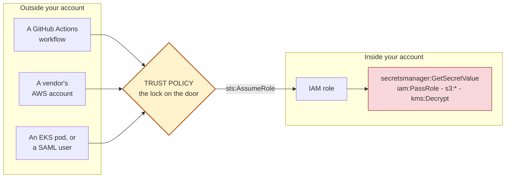
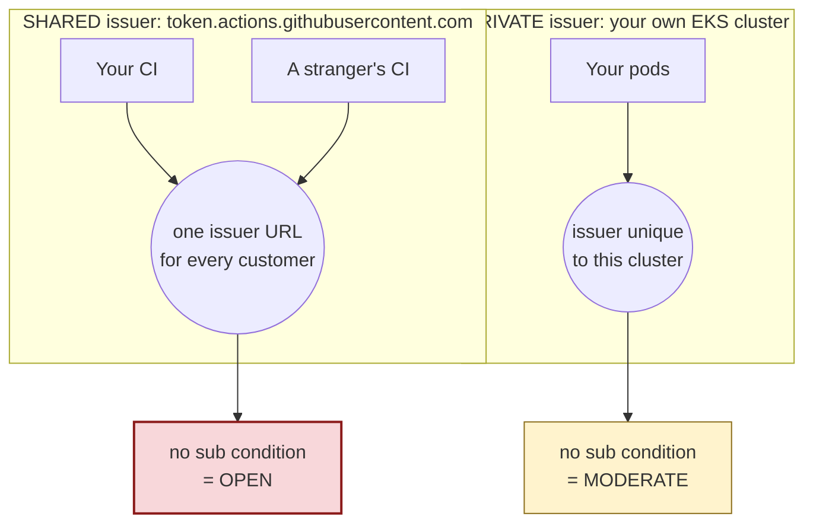

<h1 align="center">TrustEdge</h1>

<p align="center">
  <strong>AWS inbound trust boundary analyzer</strong><br>
  Finds the doors into your AWS account, grades how well each one is locked,
  and tells you what's on the other side.
</p>

<p align="center">
  <a href="https://github.com/het-P301204/TrustEdge-AWS-IAM-analyzer/actions/workflows/ci.yml"></a>
  
  
  
  <a href="LICENSE"></a>
</p>

---

## The idea in one picture

An IAM role's **trust policy** decides who is allowed to *become* that role.
It's a door. Anyone who gets through it is holding real AWS credentials.



Two questions decide whether a door matters, and **you need both answers**:

| | Question | TrustEdge calls it |
|---|---|---|
| 🚪 | How good is the lock? | **exposure** |
| 💎 | What's in the room? | **blast radius** |

A vault door on an empty room is fine. A screen door on an empty room is fine.
A screen door on the vault is the one that should wake you up. So:

```
risk = exposure × blast radius
```

---

## What it catches that a grep wouldn't

### 1. A condition that looks like a lock and isn't

```json
"Condition": {
  "StringLike":           { "token.actions.githubusercontent.com:sub": "repo:acme/deploy:*" },
  "StringEqualsIfExists": { "token.actions.githubusercontent.com:environment": "production" }
}
```

Reads like "production environment only". It isn't.

AWS documents that `...IfExists` evaluates to **true when the key is absent**,
and GitHub only sends the `environment` claim if the workflow declares one. So
a workflow that simply *doesn't mention* `environment:` sails straight through.

> TrustEdge flags `if_exists_vacuous` and refuses to count that condition as a
> lock at all.

### 2. The same missing condition meaning two different things



Every GitHub customer on earth mints tokens from that one identical URL, so a
missing subject condition lets a stranger's workflow in. Your EKS cluster has
its own issuer, so the same omission only reaches pods in *that* cluster.

> A tool that calls both "condition missing" is a tool people mute. TrustEdge
> grades them `OPEN` and `MODERATE`, and says why.

**And this is why offline analysis still matters.** AWS now rejects *new*
GitHub OIDC trust policies without a `sub` condition — but states plainly that
*"identity-provider controls will not be evaluated by IAM for existing OIDC
role trust policies."* Everything already deployed is grandfathered in.

---

## Quickstart

```bash
pip install -e .
trustedge analyze --input fixtures/sample-account.json
```

That's it — no credentials, no AWS calls, no agent. It reads a JSON file.

```bash
trustedge analyze -i export.json -o report.html    # format from the extension
trustedge analyze -i export.json --fail-on high    # CI gate
trustedge validate -i export.json                  # what couldn't be read
trustedge serve                                    # local viewer, loopback only
```

**On your own account** — read-only, and *you* run the AWS command:

```bash
aws iam get-account-authorization-details --filter Role > auth.json
trustedge convert -i auth.json --add context.json -o export.json
trustedge analyze -i export.json -o report.md
```

**Exit codes:** `0` clean · `1` found something · `2` bad input · `3` bug.
That 1-vs-2 split matters: a pipeline that treats them the same goes green the
day someone mistypes a path.

---

## The input

One JSON file. Only `roles` is required — everything else adds context, and the
report says so when it's missing.

```jsonc
{
  "account_id": "111122223333",
  "roles": [{
    "role_name": "gh-deploy",
    "arn": "arn:aws:iam::111122223333:role/gh-deploy",

    // the object being graded
    "assume_role_policy_document": {
      "Version": "2012-10-17",
      "Statement": [{
        "Effect": "Allow",
        "Principal": { "Federated": "arn:aws:iam::111122223333:oidc-provider/token.actions.githubusercontent.com" },
        "Action": "sts:AssumeRoleWithWebIdentity",
        "Condition": { "StringLike": { "token.actions.githubusercontent.com:sub": "repo:acme/app:*" } }
      }]
    },

    // resolved for blast radius
    "inline_policies": [{ "policy_name": "p", "policy_document": { "Version": "2012-10-17", "Statement": [] } }],
    "attached_managed_policies": [{ "policy_arn": "arn:aws:iam::aws:policy/AdministratorAccess" }]
  }],

  // documents for the attached policies above. A policy attached but absent
  // from here gives blast radius UNKNOWN rather than LOW - absence of evidence
  // is not evidence of absence.
  "managed_policies": [{
    "policy_arn": "arn:aws:iam::aws:policy/AdministratorAccess",
    "policy_document": { "Version": "2012-10-17",
                         "Statement": [{ "Effect": "Allow", "Action": "*", "Resource": "*" }] }
  }],

  // context AWS's own export can't give you. Operator assertions, labelled as
  // such in every finding that uses them.
  "oidc_providers":      [{ "url": "token.actions.githubusercontent.com" }],
  "saml_providers":      [{ "name": "CorpDirectory" }],
  "vendor_accounts":     { "444455556666": { "vendor": "Example Corp" } },
  "trusted_account_ids": ["222233334444"]
}
```

It's forgiving about shape, because real exports come from three different
tools: `snake_case` or AWS `PascalCase` keys, policy documents as objects or
JSON strings or URL-encoded strings, `Statement` as an object or a list,
`Action` as a string or a list. Anything unreadable becomes a named issue in
`input_issues` — never a crash, and never a silent drop.

Full schema: **[docs/product.md](docs/product.md)**

---

## How it works


The left branch reads **only** the `Principal` and `Condition` elements. The
right branch reads **only** the permission policies. Keeping them apart is the
whole point — an admin role and a read-only role behind the identical trust
policy get the *same* exposure grade and very different ranks.

---

## How it scores

Exposure and blast radius each carry a weight, and the two are **multiplied**:

| | ADMIN | HIGH | MODERATE | LOW |
|---|:--:|:--:|:--:|:--:|
| **OPEN** — anyone can walk in | 🔴 **100** | 🔴 75 | 🟠 45 | 🟡 15 |
| **WEAK** — a whole org or account | 🔴 75 | 🟠 56 | 🟡 34 | 🟢 11 |
| **MODERATE** — one repo or tenant | 🟠 45 | 🟡 34 | 🟡 20 | 🟢 7 |
| **STRONG** — one pinned identity | 🟡 15 | 🟢 11 | 🟢 7 | ⚪ 2 |

🔴 CRITICAL ≥60 · 🟠 HIGH ≥35 · 🟡 MEDIUM ≥15 · 🟢 LOW ≥5 · ⚪ INFO

Read the corners. A **STRONG lock on an ADMIN role scores 15**, and an **OPEN
door onto a role that can do nothing also scores 15**. Neither is an emergency.
The top-left corner is.

Multiplication is doing real work here — with a sum, either factor alone could
drag a finding to the top of your queue.

> Severity is **capped at MEDIUM** when TrustEdge couldn't determine the
> exposure. It won't raise an alarm on the strength of a grade it couldn't
> work out.

Full weights, bands and reasoning: **[docs/methodology.md](docs/methodology.md)**

---

## What a finding looks like

```console
$ trustedge analyze -i fixtures/sample-account.json -o report.json -f json
TrustEdge 0.1.0: 24 role(s), 26 trust statement(s), 24 finding(s)
(3 critical, 5 high, 11 medium, 4 low, 1 info) -> report.json
```

Three real findings from that run:

| Role | Lock | Room | Risk | |
|---|---|---|:--:|---|
| `partner-broad-access`<br><sub>trusts an entire external account, no external ID</sub> | `WEAK` | `ADMIN` | **75** | 🔴 CRITICAL |
| `partner-admin-pinned`<br><sub>one role ARN plus a strong external ID</sub> | `STRONG` | `ADMIN` | 15 | 🟡 MEDIUM |
| `public-status-reader`<br><sub>wildcard principal, but can only call `sts:GetCallerIdentity`</sub> | `OPEN` | `LOW` | 15 | 🟡 MEDIUM |

And here is the actual JSON for one of them — `gh-org-wide-secrets`, trimmed
from the full record but otherwise verbatim:

```json
{
  "finding_id": "TE-gh-org-wide-secrets-S0-P0-arn-aws-iam-111122223333-oidc-pr",
  "severity": "HIGH",
  "risk_score": 56,
  "score_explanation": "exposure WEAK (0.75) x blast radius HIGH (0.75) = 56, which falls in the HIGH band",
  "principal_classification": "oidc",
  "provider": "github_actions",

  "exposure": {
    "grade": "WEAK",
    "rubric": "oidc.github_actions",
    "confidence": "high",
    "who_can_assume": "Any workflow in any repository of GitHub organisation acme-corp",
    "weak_conditions": [{
      "code": "github_mutable_identifiers_only",
      "key": "token.actions.githubusercontent.com:sub",
      "vacuous": false,
      "detail": "Access is pinned only by name-based claims (sub). AWS documents that GitHub repository, organisation and user names can change, and \"a name that is freed by renaming or deletion can be claimed by a different account\". Add an immutable identifier such as repository_owner_id, repository_id or actor_id so a renamed or deleted org cannot be impersonated."
    }],
    "references": ["https://docs.aws.amazon.com/IAM/latest/UserGuide/id_roles_create_for-idp_oidc.html", "..."]
  },

  "blast_radius": {
    "tier": "HIGH",
    "admin_equivalent": false,
    "statements_evaluated": 1,
    "capabilities": [
      { "category": "data_plane", "code": "secrets_read",
        "action_pattern": "secretsmanager:GetSecretValue", "resource_patterns": ["*"] },
      { "category": "data_plane", "code": "kms_decrypt",
        "action_pattern": "kms:Decrypt", "resource_patterns": ["*"] }
    ]
  },

  "evidence": {
    "trust_statement": { "...": "the statement verbatim, so you can check the grade" },
    "conditions_parsed": { "...": "operator -> key -> values, normalised" },
    "condition_keys_seen": ["token.actions.githubusercontent.com:aud",
                            "token.actions.githubusercontent.com:sub"]
  },

  "recommendation": { "summary": "...", "tightened_trust_policy": null }
}
```

Note `"tightened_trust_policy": null`. TrustEdge only emits a rewritten policy
when it can do so **without inventing a value** — here it knows the org but not
which repositories you meant to trust, so it explains that in prose instead of
guessing.

The report is versioned (`"schema": "trustedge.report/1"`) with a `summary`,
`findings`, per-role `roles` inventory, `input_issues` and `limitations` at the
top level.

---

## What it grades

| Door | What decides the grade |
|---|---|
| **GitHub Actions OIDC** | The `sub` subject pattern, plus AWS's documented `repository`, `repository_id`, `repository_owner_id`, `job_workflow_ref`, `ref`, `environment`, `actor_id`, `enterprise_id` claims — and whether you pinned a *renameable name* or an *immutable id* |
| **EKS IRSA** | Namespace and service-account specificity, floored higher because the issuer is private to one cluster |
| **Shared OIDC issuers** | The tenancy claim AWS documents per issuer — GitLab, HCP Terraform, Buildkite, Codefresh, Scalr, Vercel, Pulumi, Cognito, Upbound and more |
| **SAML 2.0** | `saml:aud` pins the *recipient*, not the *user* — so audience-only is graded as exactly that |
| **IAM Roles Anywhere** | Trust anchor **×** certificate identity. A certificate CN is only unique *within* one CA, so pinning the CN alone isn't enough |
| **Cross-account** | Account root vs a named role, and whether `sts:ExternalId` is present *and* actually unguessable |
| **Wildcard principal** | Whether any condition bounds *identity* — an IP range or an external ID doesn't |
| **AWS services** | Confused-deputy source conditions, minus a carve-out so every Lambda role in your account isn't flagged |

**Blast radius** finds admin-equivalence, ~30 escalation primitives and
data-plane reach — and reads combinations. `iam:PassRole` alone is MODERATE;
paired with something that *runs code* it's HIGH, because passing a role only
becomes code execution when there's something to execute it.

---

## Every check it makes

**35 exposure weaknesses**, each with the AWS documentation behind it:

| Group | Codes |
|---|---|
| **Condition mechanics**<br><sub>provider-independent</sub> | `if_exists_vacuous` `forallvalues_vacuous` `negated_operator_only` `wildcard_only_value` `literal_wildcard_in_exact_operator` `null_requires_absent` `unreadable_condition_value` `if_exists_redundant` |
| **OIDC / CI federation** | `github_tenancy_not_pinned` `github_sub_org_not_pinned` `github_mutable_identifiers_only` `shared_issuer_tenancy_claim_missing` `private_issuer_subject_missing` `oidc_aud_not_pinned` `undocumented_condition_key` |
| **EKS IRSA** | `irsa_subject_missing` `irsa_subject_not_pinned` `irsa_audience_missing` |
| **Cross-account** | `external_id_missing` `external_id_weak_value` |
| **Wildcard principal** | `wildcard_principal_unconditioned` `wildcard_principal_external_id_only` `wildcard_principal_contextual_conditions_only` |
| **AWS service** | `service_principal_no_source_condition` `source_condition_too_broad` `cognito_role_without_condition` |
| **SAML** | `saml_no_conditions` `saml_no_subject_condition` `saml_aud_wildcard` |
| **Roles Anywhere** | `roles_anywhere_unconditioned` `roles_anywhere_trust_anchor_not_pinned` `roles_anywhere_identity_not_pinned` `roles_anywhere_trust_anchor_wildcarded` `roles_anywhere_certificate_pattern_broad` `roles_anywhere_source_arn_wrong_service` |

`vacuous: true` marks the subset that makes a condition enforce *nothing* —
that's the flag to filter on if you're consuming the JSON.

**44 blast-radius probes** — 29 escalation primitives, 15 data-plane — plus
four derived codes: `admin_equivalent`, `admin_via_iam_control`,
`passrole_plus_compute`, `create_role_plus_policy`, and a
`service_wildcard_<service>` code per service-wide wildcard.

**26 OIDC issuers** in the registry: 22 from AWS's own shared-provider table
with the tenancy claim each one requires, plus 4 obviously multi-tenant ones
AWS hasn't catalogued. Findings record which list a decision came from.

**17 compute-attachment service principals** carved out so `ec2`, `lambda`,
`ecs-tasks`, `pods.eks` and friends aren't flagged for a missing
confused-deputy condition. It's a named table with a per-entry justification,
not a heuristic, so you can argue with it.

---

## What it won't tell you

* **Reachability, not exploitability.** It reports what a trust policy allows.
  It never executes anything, and never claims a path is proven.
* **It only sees your side.** AWS needs an Allow in the caller's identity
  policy *and* your resource policy for cross-account access.
* **Blast radius is an approximation, not IAM.** Permissions boundaries, SCPs,
  RCPs and session policies are not evaluated.
* **Nothing external is verified** — not who owns an account, not who runs an
  OIDC issuer, not whether a vendor contract is still live.
* **Not a replacement for IAM Access Analyzer.** Different tool, different
  question. Run both.

Every one of these is printed on the finding it applies to, not buried in a
footer. Full list: **[docs/limitations.md](docs/limitations.md)**

Two claims from the original project brief were **removed** because they
couldn't be traced to a primary source. Neither appears anywhere here, and CI
fails the build if an unsourced statistic ever shows up in the docs.

---

## How it differs from what you already run

TrustEdge is **not a new security primitive.** Every signal it uses is
documented, and most are available elsewhere. What's new is the combination.

| Tool | Answers | Doesn't |
|---|---|---|
| **IAM Access Analyzer** | Is this role reachable from outside my zone of trust? Automated reasoning, live, 15 resource types | Grade *how strong* the condition is, resolve blast radius, or rank the two together. Needs enabling, and analyses external access only in the Region it's enabled in |
| **PMapper** | Who *inside* my account can become who else? Escalation graphs | Inbound trust from outside — which is the only thing TrustEdge looks at |
| **Cloudsplaining** | Are my *permission* policies over-privileged? | Trust policies. Different document, different question |
| **ScoutSuite / Prowler / Steampipe** | Hundreds of posture checks, broad coverage | Provider-aware condition grading, or pairing a trust finding with blast radius |
| **TrustEdge** | How strong is each inbound door, and what's behind it — ranked | Anything live. It reads a file |

Concretely: Access Analyzer will tell you `gh-legacy-admin` is externally
accessible. It won't tell you the reason is a missing `sub` condition on a
*shared* issuer, that the same omission on your EKS role is far less serious,
or that this particular role happens to hold `AdministratorAccess` so it should
be first in your queue.

Run Access Analyzer. Then run this on the export.

---

## Docs

| | |
|---|---|
| [research.md](docs/research.md) | Every rule traced to AWS documentation, quoted — plus **verified / inferred / removed** tables |
| [methodology.md](docs/methodology.md) | Rubrics, weights, the full risk matrix, how to change a rule |
| [threat-model.md](docs/threat-model.md) | The attacker, and the ten attack paths behind the rubrics |
| [architecture.md](docs/architecture.md) | Data flow, module boundaries, why each decision was made |
| [product.md](docs/product.md) | Export schema, finding schema, behavioural guarantees |
| [limitations.md](docs/limitations.md) | What it can't determine, and known false positives and negatives |

---

## Development

```bash
pip install -e ".[dev]"
pytest                       # 601 tests, ~1.5s
```

```
src/trustedge/
  policy.py         IAM globs, ARN parsing, policy-document coercion
  conditions.py     is this condition a guard, or decoration?
  parser.py         validation and diagnostics; the only module that rejects input
  classifier.py     Principal -> class + provider kind (nothing else)
  providers/
    oidc.py         shared/private issuer registry, GitHub, IRSA, Cognito
    aws.py          cross-account, wildcard, service principals, external IDs
    saml.py  roles_anywhere.py
  blast_radius.py   capability detection and tiering
  ranking.py        exposure x blast, severity bands, deterministic sort
  analyzer.py       orchestration
  report.py         JSON / Markdown / self-contained HTML
  convert.py        get-account-authorization-details -> export
  web.py  cli.py
```

Tests are weighted towards the parts where a mistake is silent:

| | | | |
|---|--:|---|--:|
| `test_policy.py` | 72 | `test_cli.py` | 39 |
| `test_providers_oidc.py` | 70 | `test_conditions.py` | 37 |
| `test_blast_radius.py` | 63 | `test_report.py` | 36 |
| `test_providers_aws.py` | 58 | `test_classifier.py` | 31 |
| `test_parser.py` | 49 | `test_ranking.py` | 30 |
| `test_analyzer.py` | 48 | `test_convert.py` | 22 |
| | | `test_web.py` · `saml` · `roles_anywhere` | 46 |

They drive the real pipeline — a helper builds an export dict, runs it through
`parse_export` and `analyze`, and asserts on the finding. Assertions are
written against *AWS semantics* ("an `IfExists` condition on an optional claim
does not guard") rather than against return values, so a failing test tells you
whether a rubric change was actually wrong.

Standard library only — zero runtime dependencies, so it runs air-gapped. CI
runs the suite on Python 3.9 through 3.13, byte-compiles every module, asserts
the dependency count is still zero, drives the CLI end to end including every
exit code, checks the report is byte-identical across two runs, boots the
viewer, builds the image, and scans the repo for anything credential-shaped.

```bash
docker build -t trustedge .

# --user matches the container uid to yours so it can write into a bind mount.
# Needed on Linux; Docker Desktop handles it for you.
docker run --rm --network none --user "$(id -u):$(id -g)" \
  -v "$PWD:/work" -w /work trustedge \
  analyze -i fixtures/sample-account.json -o reports/report.md
```

**Handling the export:** an IAM authorisation export is a complete map of who
can do what in your account — treat it like a credential inventory. The
analyser contains no network code at all, and `trustedge serve` binds to
loopback, holds no state and writes nothing to disk. Every fixture in this repo
is invented; the account IDs are AWS's own documentation examples.

---

## Roadmap

Multi-account trust graphs · `iam:PassRole` target resolution ·
permissions-boundary intersection · a verified GitLab subject parser ·
Terraform plan input · findings shaped for
[AegisLens](https://github.com/het-P301204/AegisLens-security-workbench) to
ingest.

---

MIT © [Het Patel](https://github.com/het-P301204)
