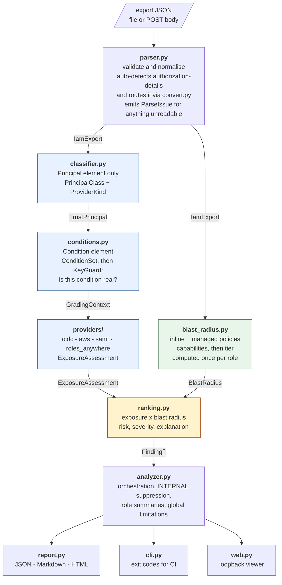

# TrustEdge architecture

## Design constraints, and what they bought

| Constraint | Consequence |
|---|---|
| **Zero runtime dependencies** | `pip install trustedge` pulls nothing. It runs in an air-gapped review environment, in a scratch container, and in a CI job with no lockfile drift. Standard library only: `json`, `re`, `argparse`, `dataclasses`, `http.server`, `urllib.parse`. |
| **No network code in the analyser** | There is nothing to audit for exfiltration. An IAM authorisation export is sensitive; the tool that reads it should not be able to send it anywhere. |
| **No AWS SDK, no credentials** | You can analyse an account you do not have access to, from an export someone hands you. |
| **Pure functions from policy to grade** | Every rubric is `(Principal, Condition) -> ExposureAssessment` with no I/O, so grades are reproducible and unit-testable without fixtures on disk. |
| **Never raise on bad data inside the export** | One malformed statement produces an issue, not a stack trace. Only "this is not an IAM export" is fatal. |

## Data flow

The blue path answers *who is on the other side of the door*, reading only the
`Principal` and `Condition` elements. The green path answers *what they get*,
reading only the permission policies. They meet for the first time in
`ranking.py`. That separation is the project's core claim, and there is a test
asserting an admin role and a read-only role behind the identical trust policy
receive the same exposure grade.

## Module responsibilities

| Module | Owns | Deliberately does not |
|---|---|---|
| `policy.py` | IAM glob matching, ARN parsing, `Statement`/`Action` normalisation, policy-document coercion (object / JSON string / URL-encoded string) | Know anything about trust, exposure or risk |
| `conditions.py` | Modelling a `Condition` block; deciding whether a condition on a key is a *guard* or decoration (`...IfExists`, `ForAllValues`, negated operators, wildcard-only values, literal `*` under exact operators) | Know which provider it is grading |
| `parser.py` | Validation, normalisation, diagnostics. The only module that decides an input is unusable | Grade anything |
| `classifier.py` | `Principal` → class + provider kind, from the Principal element **only** | Look at permissions. This separation is the project's core claim |
| `providers/oidc.py` | The shared/private issuer registry and the tenant/project/workload scope model; GitHub, IRSA, Cognito and generic rubrics | Assume a claim exists because a blog said so |
| `providers/aws.py` | Cross-account, wildcard, service-principal and external-ID rubrics | Treat every `Service` principal as an inbound boundary |
| `providers/saml.py` | SAML rubric | Pretend to see the IdP |
| `providers/roles_anywhere.py` | Roles Anywhere rubric (trust anchor × certificate identity) | Pretend to see trust anchors or CRLs |
| `blast_radius.py` | Capability detection from permission policies, tiering | Implement IAM authorisation |
| `ranking.py` | `exposure × blast`, severity bands, caps, deterministic sort | Contain any rubric logic |
| `analyzer.py` | Orchestration, one finding per (role, statement, principal), INTERNAL suppression, role summaries, global limitations | Render anything |
| `report.py` | JSON, Markdown, self-contained HTML | Decide severity |
| `convert.py` | `get-account-authorization-details` → native export, `--add` merging | Call AWS |
| `cli.py` | Argument parsing, format inference, CI exit codes | Contain analysis logic |
| `web.py` | Loopback viewer, one file, no state, no disk writes | Be a web application |

## Key design decisions and why

**One finding per (role, trust statement, principal).** A role often has
several doors with very different guards. Collapsing them into a "role finding"
hides the weak one behind the strong ones — the `multi-door-artifacts` fixture
exists to prove that does not happen (statement 0 grades STRONG, statement 1
grades WEAK, and the WEAK one ranks higher).

**Blast radius computed once per role, shared across its findings.** The
permissions do not change depending on which door you came through.

**`ProviderKind` is separate from `PrincipalClass`.** The class says what kind
of principal it is; the kind says which rubric applies. `Service:
rolesanywhere.amazonaws.com` is a service principal syntactically but needs an
entirely different rubric, and `Federated: <eks issuer>` needs a different one
again from `Federated: <github issuer>` despite both being OIDC.

**Grades and weights live in the same place.** `ExposureGrade.SCORES` and
`BlastRadiusTier.SCORES` sit next to the grade constants in `models.py`, so a
new grade cannot be added without a weight, and a test asserts exactly that.

**Findings carry their own limitations.** A limitation attached to the report
gets skimmed; one attached to the finding travels with the thing someone is
about to act on.

**`ParseIssue` instead of exceptions.** Real exports are truncated, hand-edited
and generated by three different tools. The alternative to collecting issues is
either crashing or silently dropping data, and silently dropping data in a
security tool produces a clean report from a broken input.

**A named table, not a heuristic, for the compute-attachment carve-out.** The
biggest false-positive risk in the whole tool is flagging every EC2 and Lambda
role in an account for a missing `aws:SourceAccount`. That control needs to be
reviewable and editable by whoever disagrees with it, so it is a dict with a
prose justification per entry.

## Extending it

**A new provider rubric:** add the issuer to `SHARED_OIDC_PROVIDERS` (with its
documented tenancy claim and the source), or add a `ProviderKind` and a
`_grade_*` function in the relevant `providers/` module, wire it into the
dispatch, add a fixture, add tests, and record the primary source in
`docs/research.md`.

**A new escalation primitive:** add a `Probe` to `ESCALATION_PROBES` with its
`detail` explaining *why* it matters, add it to `COMPUTE_CREATE_CODES` if it
runs code, and add a case to `test_blast_radius.py`.

**A new output format:** add a renderer to `report.py` and register it in
`RENDERERS`. `cli.py` picks it up from `FORMATS` and the extension map.

## Testing strategy

Tests drive the real pipeline — `conftest.analyze_statements()` builds an export
dict, runs it through `parse_export` and `analyze`, and asserts on the finding.
Tests that construct model objects by hand and assert on them prove nothing
about the rubric, so there are almost none.

Assertions are written against *AWS semantics* rather than return values where
possible: "an `IfExists` condition on an optional claim does not guard" rather
than "`analyze_key` returns `guards=False`". When a rubric has to change, the
test should be the thing that tells you whether the change is correct.
